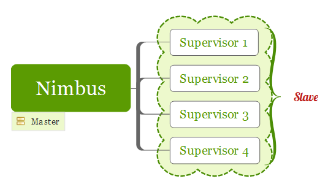
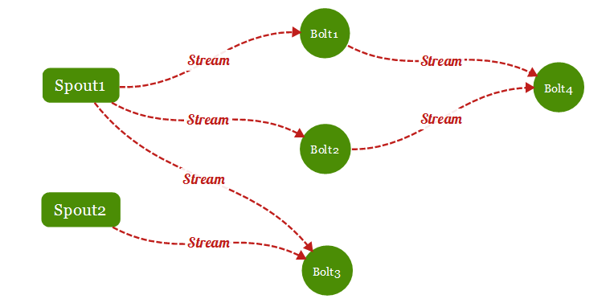
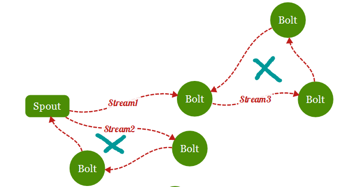
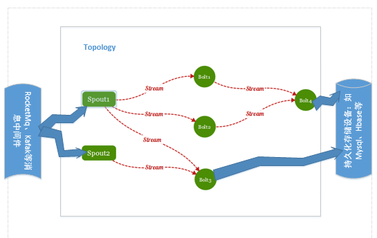
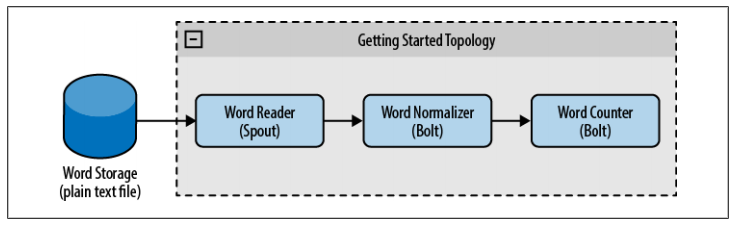
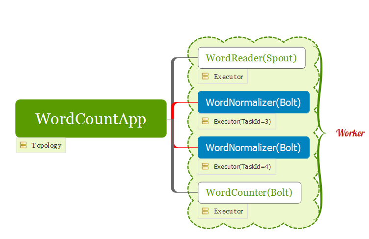

Storm
===

> 分布式实时流式数据处理,属于大数据计算的范畴,而hadoop是分布式批处理计算

## Storm集群结构  
  
和传统的集群架构基本一样,主节点Nimbus负责任务调度,起到一个管理的角色,从节点负责任务执行,起到一个包工头的角色.

- Nimbus 分发任务和监控,不关心有几个supervisor,关心的是worker数量
- Supervisor 在接到任务之后,**它会启动一个或者多个进程(称之为worker,一个supervisor最多起4个进程)**,任务最终由worker执行

## 任务分配
  
任务不是平均分给supervisor,而是以worker为单位开始分,每个worker只能运行一个topology,一个topology可能需要多个worker  

## 拓扑明细  
  

**Topology**：在这个Topology中，我们看到两个Spout和四个Bolt。在Topology中，我们将Spout和Bolt称之为组件(Components)。一个Topology中，必须同时存在Spout和Bolt，Spout和Bolt数量可以随意。要提醒的是：Topology的组件目前只有Spout和Bolt，没有其他组件。所以以后提到一个Topology的组件的时候，其实也就是指的是Spout或者Bolt。  
  
**Stream**：我们已经知道Spout是从外部数据源中获取数据，以一定的格式将数据传递给Bolt处理。从Spout中源源不断的给Bolt传递数据，形成的这个数据通道我们称之为Stream(流)。因为Strom是一个实时计算的流式处理框架，其不是像hadoop那样，一次性处理一大批的数据(批处理)，Storm是不断从外部数据源中获取最新的数据，然后将新的数据传递给Bolt处理(增量处理)。这样不断的获取与传输就形成了这个数据流通道就称之为Stream，如上图的虚线所示。  
  
**Tuple**：Tuple这个概念在上面没有明显的标记出来，其实Stream的最小组成单元。上图中的Steam是一条虚线，我们可以将虚线中的每一个小线段"-"看成一个Tuple。因为Storm的Spout需要源源不断的向Bolt发送数据，每一次发送的数据我们称之为一个Tuple，也就是说,Stream流实际上就是通过这些源源不断的Tuple组成。在Storm官网上有这样一句话" A stream is an unbounded sequence of tuples ..."，unbounded的意思其实就是说，Spout是源源不断的发送Tuple给Bolt的，我们不知道什么时候会停止发送Tuple，因此当然是无边界的。

## 有向无环图

在storm中，spout和bolt、bolt与bolt之间的数据流向，将整合topology串起来了。  
有向无环图，意思就是数据流是有方向的，但是不能形成一个环状。如果形成了一个环状，那么意味着Bolt中的数据还可能传给Spout，spout又要传递给Bolt。这就形成了一个死循环，Stream中的一个数据(Tuple)永远也没办法处理完。
以上这个图有2个环，不论是右上Bolt之间形成的环，还是右下Spout与Bout之间形成的环，都是不允许。

## 数据源和输出选择

## project 流程图

## 任务分配后记

每个worker相当于一个进程,可以为spout,bolt设置并发度,worker根据并发度来相应的多起几个线程,线程称之为executor.一个executor是spout 和bolt的最小运行单位.而woker是topology的最小运行单位.  
一个worker中可以有多个executor,每个executor可以执行spout,也可以执行bolt

## grouping 策略
storm里面有6种类型的stream grouping:
- Shuffle Grouping: 随机分组， 随机派发stream里面的tuple， 保证每个bolt接收到的tuple数目相同。轮询，平均分配。
- Fields Grouping：按字段分组， 比如按userid来分组， 具有同样userid的tuple会被分到相同的Bolts， 而不同的userid则会被分配到不同的Bolts。
- All Grouping： 广播发送， 对于每一个tuple， 所有的Bolts都会收到。
- Global Grouping: 全局分组， 这个tuple被分配到storm中的一个bolt的其中一个task。再具体一点就是分配给id值最低的那个task。
- Non Grouping: 不分组， 这个分组的意思是说stream不关心到底谁会收到它的tuple。目前这种分组和Shuffle grouping是一样的效果，不平均分配。
- Direct Grouping: 直接分组， 这是一种比较特别的分组方法，用这种分组意味着消息的发送者举鼎由消息接收者的哪个task处理这个消息。 只有被声明为Direct Stream的消息流可以声明这种分组方法。而且这种消息tuple必须使用emitDirect方法来发射。消息处理者可以通过TopologyContext来或者处理它的消息的taskid(OutputCollector.emit方法也会返回taskid) 