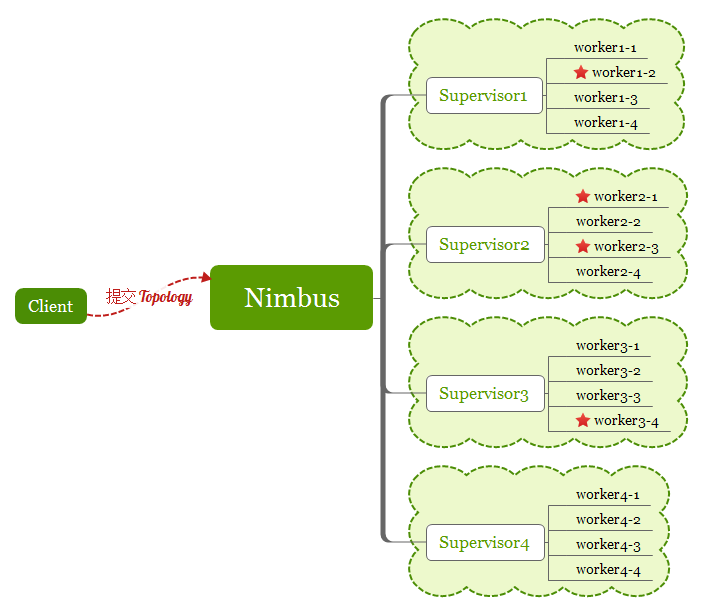

Storm
===

> 实时流式数据处理,属于大数据计算的范畴

## Storm集群结构  
  
和传统的集群架构基本一样,主节点Nimbus负责任务调度,起到一个管理的角色,从节点负责任务执行,起到一个包工头的角色.

- Nimbus 分发任务和监控,不关心有几个supervisor,关心的是worker数量
- Supervisor 在接到任务之后,**它会启动一个或者多个进程(称之为worker,一个supervisor最多起4个进程)**,任务最终由worker执行

## 任务分配
  
任务不是平均分给supervisor,而是以worker为单位开始分,每个worker只能运行一个topology,一个topology可能需要多个worker  

## 拓扑明细  
  
