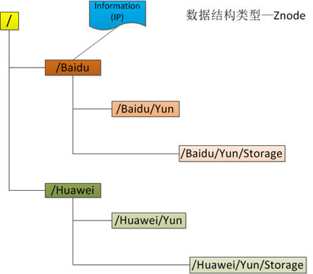

Zookeeper
===

## 由来和作用

### 由来
  

假设在第一台机器上挂载了一个资源，然后这三个物理分布的进程都要竞争这个资源，但我们又不希望他们同时进行访问，这时候我们就需要一个协调器，来让他们有序的来访问这个资源。这个协调器就是我们经常提到的那个锁，比如说"进程-1"在使用该资源的时候，会先去获得锁，"进程1"获得锁以后会对该资源保持独占，这样其他进程就无法访问该资源，"进程1"用完该资源以后就将锁释放掉，让其他进程来获得锁，那么通过这个锁机制，我们就能保证了分布式系统中多个进程能够有序的访问该临界资源。那么我们把这个分布式环境下的这个锁叫作分布式锁。这个分布式锁也就是我们分布式协调技术实现的核心内容，那么如何实现这个分布式呢，那就是我们后面要讲的内容。

### 作用
分布式锁、配置维护、组服务

### zookeeper 能解决的问题 
在同一台机器上，你对一个服务的调用如果成功，那就是成功，如果调用失败，比如抛出异常那就是调用失败。但是在分布式环境中，由于网络的不可靠，你对一个服务的调用失败了并不表示一定是失败的，可能是执行成功了，但是响应返回的时候失败了。还有，A和B都去调用C服务，在时间上 A还先调用一些，B后调用，那么最后的结果是不是一定A的请求就先于B到达呢？ 这些在同一台机器上的种种假设，我们都要重新思考，我们还要思考这些问题给我们的设计和编码带来了哪些影响。还有，在分布式环境中为了提升可靠性，我们往往会部署多套服务，但是如何在多套服务中达到一致性，这在同一台机器上多个进程之间的同步相对来说比较容易办到，但在分布式环境中确实一个大难题。

所以分布式协调远比在同一台机器上对多个进程的调度要难得多，而且如果为每一个分布式应用都开发一个独立的协调程序。一方面，协调程序的反复编写浪 费，且难以形成通用、伸缩性好的协调器。另一方面，协调程序开销比较大，会影响系统原有的性能。所以，急需一种高可靠、高可用的通用协调机制来用以协调分布式应用。 

## 整体架构
  

| 部分 | 说明 |
|---|---|
| Client | zookeeper的管理对象,从服务器中访问信息.与服务器会保持一个连接 |
| Server | Zookeeper节点,又称之为**znode**,提供服务 |
| Ensemble | 服务器组 |
| Leader | 服务器节点,在服务启动时选举产生 |
| Follower | 跟随leader指令的服务器节点 |

## 数据模型
### Znode
  
Znode通过路径引用,如同Unix中的文件路径.路径必须是绝对的,因此他们必须由斜杠字符来**开头**.除此之外,他们必须是唯一的,也就是说每一个路径都只有一个表示，因此这些路径不能改变。ZooKeeper中，路径由Unicode字符串组成，并且有一些限制。字符串"/zookeeper"用以保存管理信息，比如关键配额信息。

### 节点类型
节点类型在被创建时指定,不能被修改.

- 永久节点
- 临时节点(不允许拥有子节点,Session结束,即被删除)
- 顺序节点(顺序节点可以为永久或者临时)

### 观察
客户端可以在节点上设置watch,我们称之为**监视器**.当节点状态发生改变时(znode的增删改)将会除法watch所对应的操作.当watch被触发时,zookeeper将会向客户端发送并且只发送一条通知,因为watch只能被触发一次,这样可以减少网络流量.

### 时间

(1) Zxid
致使ZooKeeper节点状态改变的每一个操作都将使节点接收到一个Zxid格式的时间戳，并且这个时间戳全局有序。也就是说，也就是说，每个对 节点的改变都将产生一个唯一的Zxid。如果Zxid1的值小于Zxid2的值，那么Zxid1所对应的事件发生在Zxid2所对应的事件之前。实际 上，ZooKeeper的每个节点维护者三个Zxid值，为别为：cZxid、mZxid、pZxid。

- ① cZxid： 是节点的创建时间所对应的Zxid格式时间戳。
- ② mZxid：是节点的修改时间所对应的Zxid格式时间戳。

实现中Zxid是一个64为的数字，它高32位是epoch用来标识leader关系是否改变，每次一个leader被选出来，它都会有一个 新的epoch。低32位是个递增计数。 

(2)版本号

对节点的每一个操作都将致使这个节点的版本号增加。每个节点维护着三个版本号，他们分别为：
- ① version：节点数据版本号
- ② cversion：子节点版本号
- ③ aversion：节点所拥有的ACL版本号

## 安装

### 单节点

```
mkdir -p /soft && cd /soft
wget -O zookeeper.tar.gz http://mirrors.hust.edu.cn/apache/zookeeper/zookeeper-3.5.2-alpha/zookeeper-3.5.2-alpha.tar.gz

tar -zxf zookeeper.tar.gz
cd zookeeper
current_path=$(pwd)
mkdir -p data
mkdir -p logs


echo "tickTime=2000" > conf/zoo.cfg
echo "dataDir=${current_path}/data" >> conf/zoo.cfg
echo "dataLogDir=${current_path}/logs" >> conf/zoo.cfg
echo "clientPort=2182" >> conf/zoo.cfg

sh ${current_path}/bin/zkServer.sh start
```


### 集群

```
mkdir -p /soft && cd /soft
wget -O zookeeper.tar.gz http://mirrors.hust.edu.cn/apache/zookeeper/zookeeper-3.5.2-alpha/zookeeper-3.5.2-alpha.tar.gz

tar -zxf zookeeper.tar.gz

zoo="zookeeper"
clientport=2181

for index in 1 2 3 ; do 
    rm -rf ${zoo}${index}
    cp -r ${zoo} ${zoo}${index}
    cd ${zoo}${index}

    current_path=$(pwd)
    mkdir -p data
    mkdir -p logs

    echo "tickTime=2000" > conf/zoo.cfg
    echo "dataDir=${current_path}/data" >> conf/zoo.cfg
    echo "dataLogDir=${current_path}/logs" >> conf/zoo.cfg
    echo "clientPort=${clientport}" >> conf/zoo.cfg
    echo "syncLimit=2" >> conf/zoo.cfg
    echo "initLimit=5" >> conf/zoo.cfg
    echo "server.1=$(hostname -i):2888:3888" >> conf/zoo.cfg
    echo "server.2=$(hostname -i):4888:5888" >> conf/zoo.cfg
    echo "server.3=$(hostname -i):6888:7888" >> conf/zoo.cfg

    echo ${index} > data/myid

    sh ${current_path}/bin/zkServer.sh start
    cd ..
    let clientport++
done
```